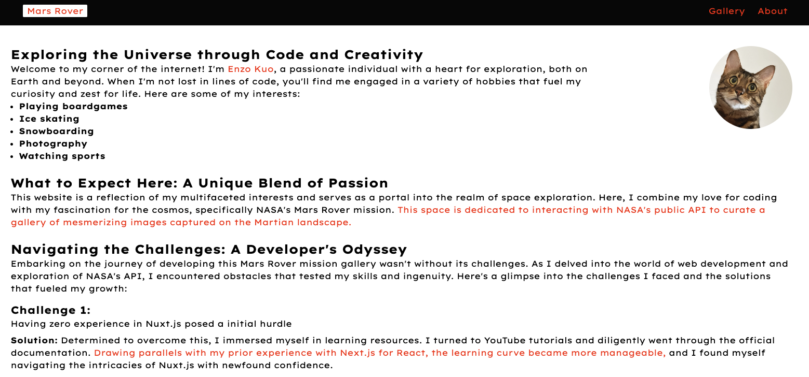

## Note

- To run on local machine, make sure to create a file called .env with "NASA_API_KEY=example" in it
- [Vercel URL](https://api-assignment-cyan.vercel.app/)

## Demo

### Home Page:

**Desktop**
</br>
Hero

<div align="center">
  
</div>
</br>
Gallery
<div align="center">
  
</div>
</br>
Modal
<div align="center">
  
</div>
</br>

**Mobile**
</br>
Hero

<div align="center">
  
</div>
</br>
Gallery
<div align="center">
  
</div>
</br>

### About Page:

<div align="center">
  
</div>

### Error Page:

<div align="center">
  
</div>

## Nuxt 3 Minimal Starter

Look at the [Nuxt 3 documentation](https://nuxt.com/docs/getting-started/introduction) to learn more.

### Setup

Make sure to install the dependencies:

```bash
# npm
npm install

# pnpm
pnpm install

# yarn
yarn install

# bun
bun install
```

### Development Server

Start the development server on `http://localhost:3000`:

```bash
# npm
npm run dev

# pnpm
pnpm run dev

# yarn
yarn dev

# bun
bun run dev
```
